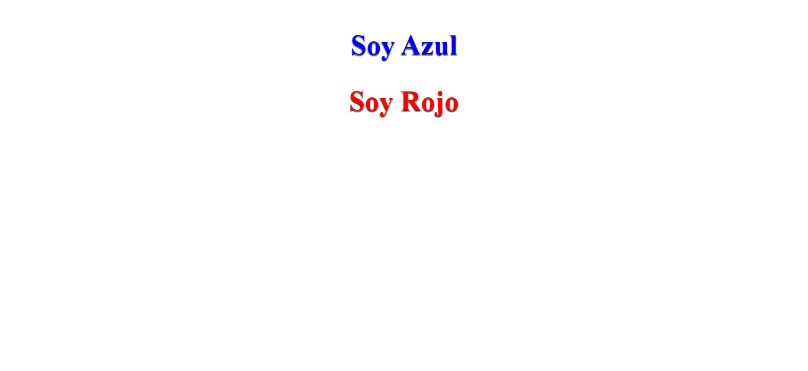
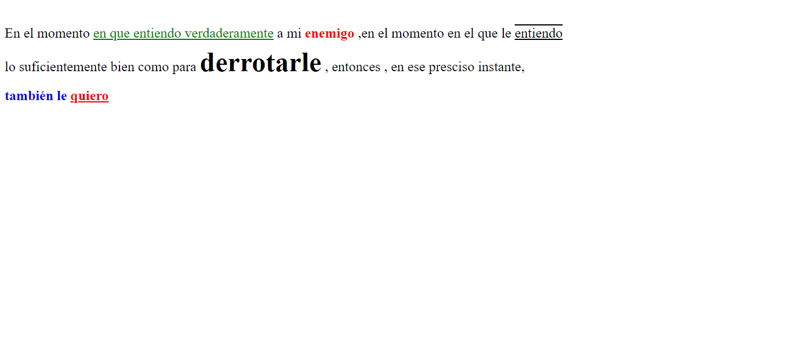
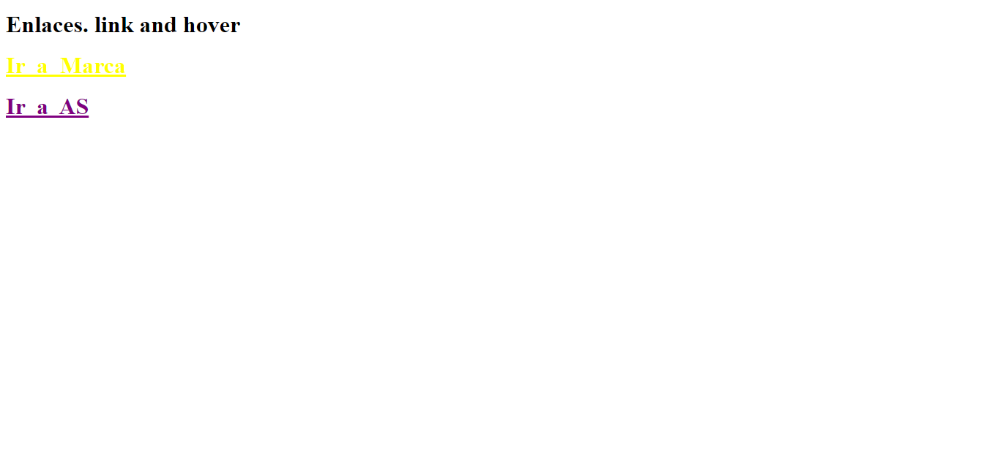
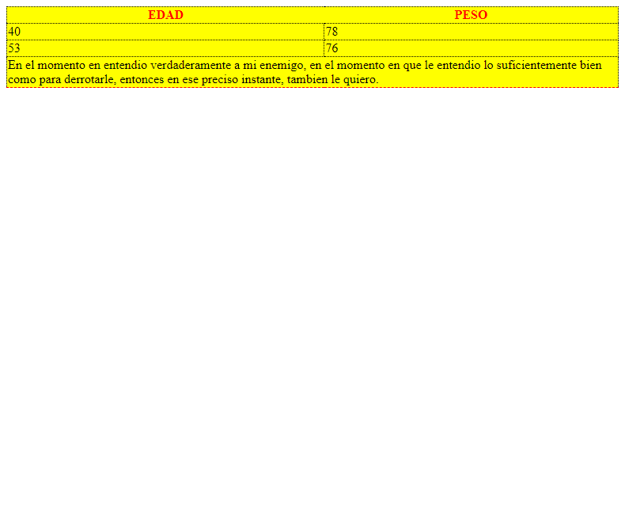

<h1>Taller 9 - Andrey Felipe Mahecha Gómez</h1>

<h2>Información</h2>

 Curso : Full Stack Básico - Grupo 1 

 Profesor : Cristian Patiño

<h2>Link de la página Web</h2>
<a href="https://afmahego.github.io/taller-9-full-stack/">Link de la página Web</a>

<h2>Punto 1: Link de Figma</h2>
<a href="https://www.figma.com/file/6qX2uHkgchbf0BjRmYKcUP/Felipe-Mahecha-G%C3%B3mez?type=design&node-id=0%3A1&mode=design&t=sejKlPn19bRgC8On-1">Link de Figma</a>

<h2>Punto 2 : Diseño HTML</h2>

<h2>Punto 3 : Diseño con CSS</h2>

<h2>Punto 4 : Títulos</h2>

<h2>Punto 5 : Párrafos</h2>

<h2>Punto 6 : Links</h2>

<h2>Punto 7 y 8 : Navegación</h2>

<h2>Punto 9 : Tabla</h2>
